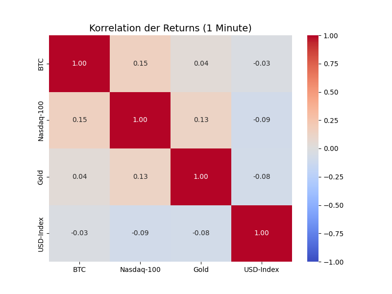
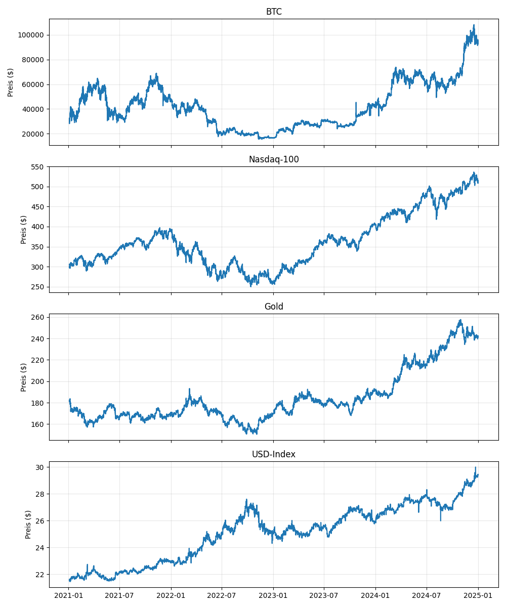

# USW-Group-10

## Members
- Viet Anh Hönemann (Matrikelnummer: S0587778)
- Julius Bollmann (Matrikelnummer: S0594551)

## Trading Review: Problem Definition, Data Acquisition & Understanding

### 1. Problem Definition

**Target Variable**
The goal is to predict the market trend direction for Bitcoin (BTC/USD).
Specifically, we treat this as a **Binary Classification Problem**:
- **Target (y):** Will the Close Price at time $t+60$ (in 1 hour) be higher than the Close Price at time $t$ (now)?
  - `1` (Long/Buy): Price(t+60) > Price(t)
  - `0` (Short/Sell): Price(t+60) <= Price(t)

**Input Variables (Features)**
For every minute from 2020-01-01 until 2025-01-01, we utilize a rich feature set combining crypto-native data with macroeconomic indicators:

1.  **Crypto Market Data (24/7):**
    - `BTC/USD`: Open, High, Low, Close, Volume, Trade Count, VWAP.

2.  **Macroeconomic Correlation Indicators (Market Hours):**
    To capture "Risk-On/Risk-Off" sentiment and dollar strength, we include external assets:
    - **Tech Sentiment:** `QQQ` (Invesco QQQ Trust) as a proxy for the **Nasdaq-100**.
    - **Safe Haven:** `GLD` (SPDR Gold Shares) as a proxy for **Gold**.
    - **Currency Strength:** `UUP` (Invesco DB US Dollar Index Bullish Fund) as a proxy for the **US Dollar Index (DXY)**.

3.  **Derived Technical Indicators (Feature Engineering):**
    - **Momentum:** RSI (14), MACD.
    - **Trend:** SMA (50), EMA (200).
    - **Volatility:** Bollinger Bands.
    - **Pattern Recognition:** Automated detection using `pandas-ta`.

---

### 2. Data Acquisition Strategy

**"Alpaca-Only" Ecosystem**
To ensure data consistency and reliability, we strictly avoided web scraping (e.g., yfinance). Instead, we architected a solution that fetches **both** Cryptocurrency and Stock Market data solely via the **Alpaca Market Data API (v2)**.

**Handling Asynchronous Markets**
A key challenge was merging 24/7 Crypto data with Stock data (which has weekends and holidays).
- **Solution:** We use **Forward Filling (`ffill`)** logic. If the Nasdaq is closed (e.g., on Saturday), the last known Friday price is carried forward to maintain a continuous time-series for the Bitcoin trading bot without dropping data.

**Technical Specs**
- **API Services:** `CryptoHistoricalDataClient` (for BTC) & `StockHistoricalDataClient` (for ETFs).
- **Timeframe:** `1 Minute` (High-frequency granularity).
- **Storage:** **Apache Parquet** (`.parquet`) for high-performance I/O and compression.

**Scripts:**
- [`project/scripts/01_data_acquisition/data_acquisition.py`](project/scripts/01_data_acquisition/data_acquisition.py): Fetches BTC/USD.

- [`project/scripts/01_data_acquisition/fetch_external_data.py`](project/scripts/01_data_acquisition/fetch_external_data.py): Fetches QQQ, GLD, UUP.

---

### 3. Data Understanding & Visualization

We implemented an automated plotting pipeline [`project/scripts/02_data_understanding/plotter.py`](project/scripts/02_data_understanding/plotter.py) to inspect data quality and correlations.

**Visual Outputs (generated in `project/images`):**
1.  **Normalized Performance:** Compares relative growth of BTC vs. Nasdaq/Gold (Start = 100%).
2.  **Asset Subplots:** Checks for data gaps and structural integrity across all assets.
3.  **Correlation Matrix:** Analyzes the relationship between Bitcoin returns and Macro factors (e.g., negative correlation with USD).

**Example Plots:**
- *Normalized Performance Comparison*  
  
- *Correlation Matrix*  
  
- *Asset Subplots*  
  